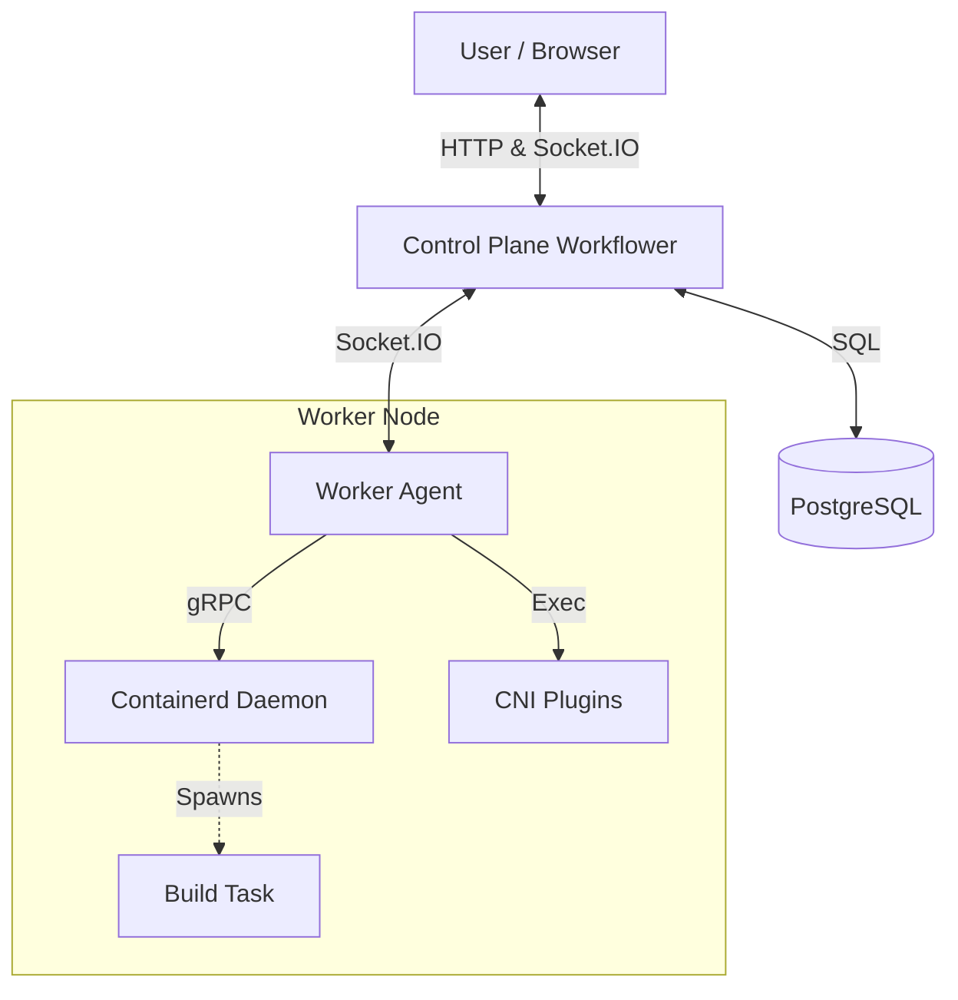

🚀 Mini-CI

    

Mini-CI is a high-performance, event-driven Continuous Integration system built from scratch.

Mini-CI interacts directly with containerd and CNI (Container Network Interface) to manage isolated build environments, bypassing the Docker daemon entirely for lower overhead and granular control. It features a reactive Vue.js frontend for real-time visualization of build pipelines.

✨ Key Features

⚡ Low-Level Container Management: Direct integration with containerd via gRPC for managing OCI containers.

🛡️ Network Isolation: Custom networking implementation using CNI plugins (Bridge, Firewall, IPAM) to isolate build tasks.

📡 Real-Time Streaming: Zero-latency log streaming and status updates using Socket.IO and an internal Event Bus.

📝 Pipelines as Code: Define workflows using simple, declarative YAML configuration.

📊 Interactive UI: A modern Vue 3 dashboard featuring pipeline graphs, live logs, and build history.

🛑 Build Control: Support for aborting running builds with immediate signal propagation to worker processes.

🛠️ Architecture

Mini-CI follows a modular architecture:



Tech Stack
Component	Technology	Description
Backend	Golang	API Server, Orchestrator, and Event Engine.
Frontend	Vue 3, TypeScript	Vite-based SPA with composition API.
Runtime	Containerd	Industry-standard container runtime.
Networking	CNI	libcni, bridge, host-local.
Database	PostgreSQL	Persistent storage for workflows and logs.
Messaging	Socket.IO	Real-time bidirectional communication.
📸 Screenshots
1. Workflow Pipeline Visualization

Visualize jobs and their statuses in real-time.


2. Live Log Terminal

Stream logs directly from the containerd task.


3. YAML Configuration Editor

Edit and validate your CI pipelines.


🚀 Getting Started
Prerequisites

Linux (Required for CNI/Network Namespaces) or a VM.

Docker & Docker Compose (For running the full stack easily).

Installation via Docker Compose

The easiest way to run Mini-CI is using the provided Docker Compose setup, which handles the complex privileges required for nested containerization.

Clone the repository:

```shell
Bash
git clone https://github.com/yourusername/mini-ci.git
cd mini-ci
```

Start the services:

```shell
docker-compose up -d --build
```

Access the application:

Frontend: Open http://localhost:5173 (or the configured frontend port).

API: Available at http://localhost:8080.

Manual Development Setup

If you wish to run the backend locally (on Linux), ensure you have:

containerd installed and running.

CNI plugins installed at /opt/cni/bin.

Root privileges (required to create network namespaces).

📖 Usage
Defining a Workflow

Mini-CI uses a YAML syntax to define jobs and tasks. Create a new workflow in the UI and paste the following:


```yaml
jobs:
  - name: test-build
    run:
      image: docker.io/library/golang:1.25
      env:
        - "GOOS=linux"
      scripts:
        - name: check-version
          command: ["go", "version"]
        - name: run-tests
          command: ["go", "test", "./..."]
  
  - name: package
    run:
      image: docker.io/library/alpine:latest
      scripts:
        - name: archive
          command: ["tar", "-czf", "release.tar.gz", "."]
```

Running a Build

Navigate to your created Workflow.

Click the Run button.

Watch the graph turn from Pending (Yellow) to Finish status (Succeed, Failed, Aborted, etc.)

Click on a Job node to view the live logs.

🤝 Contributing

Fork the repository.

Create your feature branch (git checkout -b feature/amazing-feature).

Commit your changes.

Push to the branch.

Open a Pull Request.

📄 License

Distributed under the MIT License. See LICENSE for more information.

